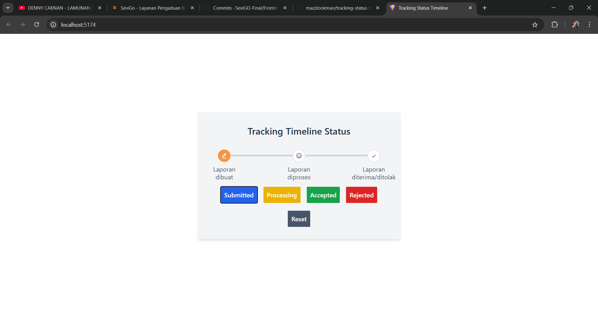
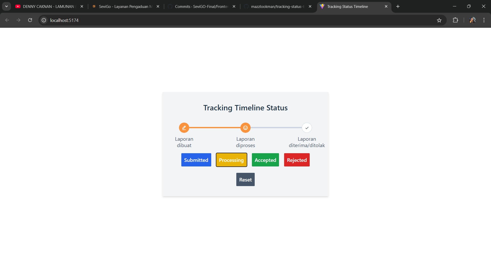
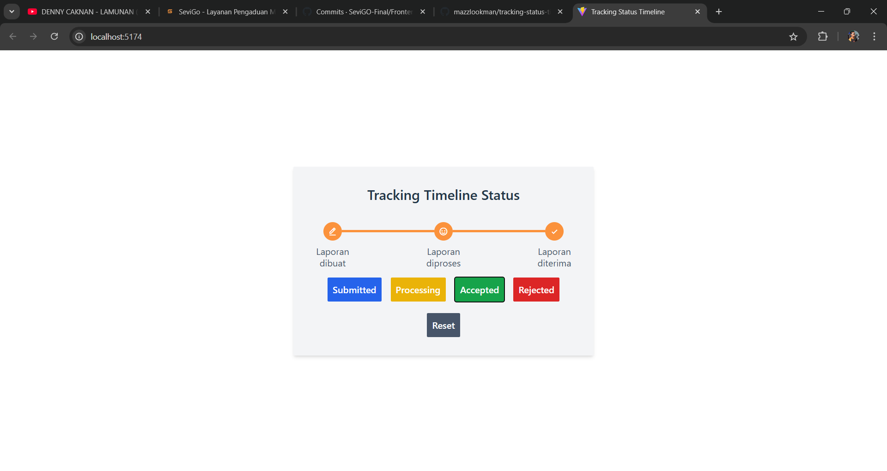
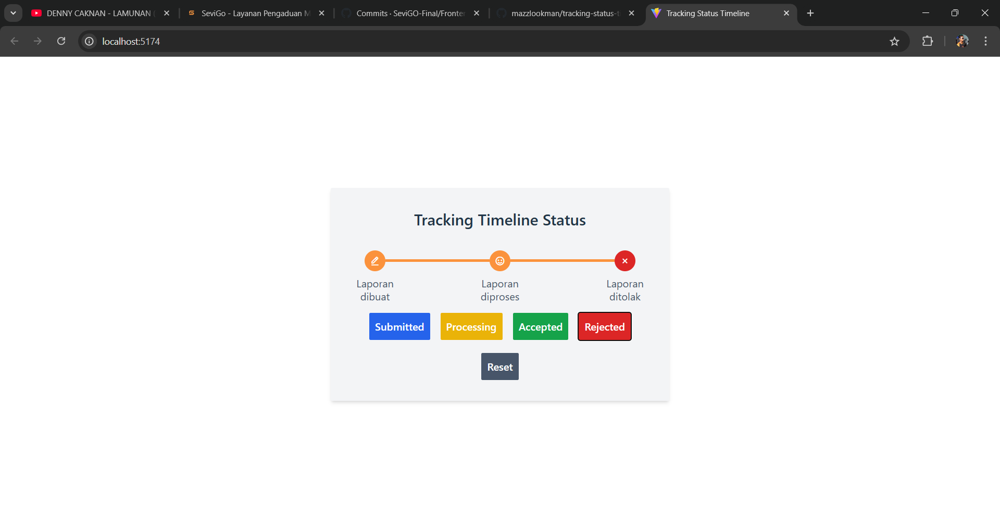

# **Tracking Timeline UI**

Tracking Timeline UI ini merupakan project saya dalam belajar **React** yang menampilkan status proses pengiriman suatu Complaint (bisa juga Product) dalam bentuk visual timeline. Proyek ini menggunakan **Tailwind CSS** untuk library CSS-nya, implementasi pendekatan **Atomic Design Pattern** untuk pengelolaan komponen yang modular dan terstruktur, serta menggunakan **React dengan TypeScript**, sehingga memberikan development experience yang lebih aman dan terorganisir.

## **Fitur Utama**
- **Timeline Visual Interaktif**: Menampilkan proses status laporan, seperti *Submitted*, *Processing*, hingga *Accepted* atau *Rejected*, dengan transisi visual yang dinamis.
- **State Management Lokal**: Menggunakan *React state* untuk memantau dan memperbarui status laporan secara real-time.
- **Modular Components**: Setiap bagian UI dibangun menggunakan pendekatan *Atomic Design* yang terdiri dari *atoms*, *molecules*, dan *pages*, sehingga memudahkan pengembangan dan pemeliharaan.
- **TypeScript Support**: Menjamin kode lebih aman dengan tipe data yang jelas.

## **Teknologi yang Digunakan**
- **React**: Framework JavaScript untuk membangun antarmuka pengguna.
- **TypeScript**: Menambahkan dukungan tipe statis untuk JavaScript.
- **Tailwind CSS**: Library CSS yang fleksibel dan memudahkan pembuatan desain UI.
- **Atomic Design Pattern**: Pendekatan sistematis untuk membangun antarmuka dengan hierarki komponen yang terorganisir.

## **Struktur Project**
Project ini menggunakan pendekatan *Atomic Design*, yang membagi komponen menjadi beberapa kategori:
- **Atoms**: Komponen UI terkecil seperti tombol, ikon, dan garis.
- **Molecules**: Kombinasi dari beberapa atoms untuk membentuk blok UI yang lebih kompleks (misalnya, TrackingTimeline).
- Khusus untuk **Atoms dan Molecules**, saya gabung menjadi 1 pada file `index.tsx` didirektori yang sama untuk penyederhanaan penggunaan direktori
- **Pages**: Penggabungan molecules untuk membentuk halaman lengkap.

## **Cara Menjalankan Project**
Berikut langkah-langkah menjalankan project ini di lokal:
1. **Clone Repository**
   ```bash
   git clone https://github.com/mazzlookman/tracking-status-timeline-simple.git .
   ```

2. **Install Dependencies**
   Pastikan Node.js telah diinstal di perangkat Anda.
   ```bash
   npm install
   ```

3. **Jalankan Project**
   ```bash
   npm run dev
   ```
   Akses project di [http://localhost:5173](http://localhost:5173).

4. **Build untuk Produksi**
   Untuk membangun aplikasi dalam mode produksi:
   ```bash
   npm run build
   ```

## **Demo**
Berikut adalah tampilan *tracking timeline*:
Submitted:


Processing:


Accepted:


Rejected:


## **Kontribusi**
Dengan senang hati saya menerima! Silahkan membuat *pull request* untuk memperbaiki bug, menambahkan fitur, atau meningkatkan kualitas code.

1. **Fork** repositori ini.
2. Buat *branch* baru:
   ```bash
   git checkout -b feature/nama-fitur
   ```
3. Commit perubahan:
   ```bash
   git commit -m "Menambahkan fitur nama-fitur"
   ```
4. Push ke *branch*:
   ```bash
   git push origin feature/nama-fitur
   ```
5. Buat *pull request* di GitHub.

Thanks. ✨